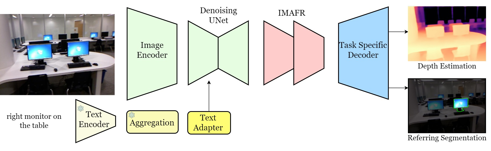

# EVP
<a href='https://lavreniuk.github.io/EVP'></a> <a href='https://arxiv.org/abs/2312.08548'></a>  <a href='https://huggingface.co/spaces/MykolaL/evp'></a>
[](https://colab.research.google.com/drive/1rd0_2AMyHlEaeYlWldZ-xGaGRYhP_TVb?usp=sharing)

[](https://paperswithcode.com/sota/depth-estimation-on-nyu-depth-v2?p=evp-enhanced-visual-perception-using-inverse)
<br>
[](https://paperswithcode.com/sota/monocular-depth-estimation-on-nyu-depth-v2?p=evp-enhanced-visual-perception-using-inverse) 
<br>
[](https://paperswithcode.com/sota/monocular-depth-estimation-on-kitti-eigen?p=evp-enhanced-visual-perception-using-inverse)
<br>
[](https://paperswithcode.com/sota/referring-expression-segmentation-on-refcoco-7?p=evp-enhanced-visual-perception-using-inverse)

by [Mykola Lavreniuk](https://scholar.google.com/citations?hl=en&user=-oFR-RYAAAAJ), [Shariq Farooq Bhat](https://shariqfarooq123.github.io/), [Matthias Müller](https://matthias.pw/), [Peter Wonka](https://peterwonka.net/)

This repository contains PyTorch implementation for paper "EVP: Enhanced Visual Perception using Inverse Multi-Attentive Feature Refinement and Regularized Image-Text Alignment". 

*Currently it contains only inference code and trained models. The training code for reproduction will be added soon.*

EVP (<ins>**E**</ins>nhanced <ins>**V**</ins>isual <ins>**P**</ins>erception) builds on the previous work VPD which paved the way to use the Stable Diffusion network for computer vision tasks.



## Installation
Clone this repo, and run
```
git submodule init
git submodule update
```
Download the checkpoint of [stable-diffusion](https://github.com/runwayml/stable-diffusion) (we use `v1-5` by default) and put it in the `checkpoints` folder. Please also follow the instructions in [stable-diffusion](https://github.com/runwayml/stable-diffusion) to install the required packages.


## Referring Image Segmentation with EVP
EVP achieves 76.35 overall IoU and 77.61 mean IoU on the validation set of RefCOCO.

Please check [refer.md](./refer/README.md) for detailed instructions on training and inference.

## Depth Estimation with EVP
EVP obtains 0.224 RMSE on NYUv2 depth estimation benchmark, establishing the new state-of-the-art.

|  | RMSE | d1 | d2 | d3 | REL  | log_10 |
|---------|-------|-------|--------|------|-------|-------|
| **EVP** | 0.224 | 0.976 | 0.997 | 0.999 | 0.061 | 0.027 |

EVP obtains 0.048 REL and 0.136 SqREL on KITTI depth estimation benchmark, establishing the new state-of-the-art.

|  | REL | SqREL | RMSE | RMSE log | d1 | d2 | d3 |
|---------|-------|-------|--------|------|-------|-------|-------|
| **EVP** | 0.048 | 0.136 | 2.015 | 0.073 | 0.980 | 0.998 | 1.000 |

Please check [depth.md](./depth/README.md) for detailed instructions on training and inference.

## License
MIT License

## Acknowledgements
This code is based on [stable-diffusion](https://github.com/CompVis/stable-diffusion), [mmsegmentation](https://github.com/open-mmlab/mmsegmentation), [LAVT](https://github.com/yz93/LAVT-RIS), [MIM-Depth-Estimation](https://github.com/SwinTransformer/MIM-Depth-Estimation) and [VPD](https://github.com/wl-zhao/VPD)

## Citation
If you find our work useful in your research, please consider citing:
```
@misc{lavreniuk2023evp,
  url = {https://arxiv.org/abs/2312.08548},
  author = {Lavreniuk, Mykola and Bhat, Shariq Farooq and Müller, Matthias and Wonka, Peter},
  title = {EVP: Enhanced Visual Perception using Inverse Multi-Attentive Feature Refinement and Regularized Image-Text Alignment},
  publisher = {arXiv},
  year = {2023},
}
```
